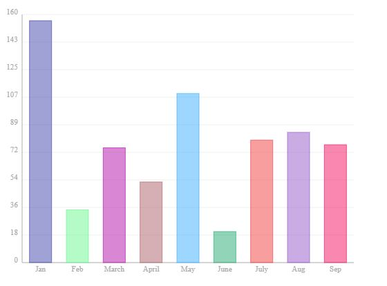
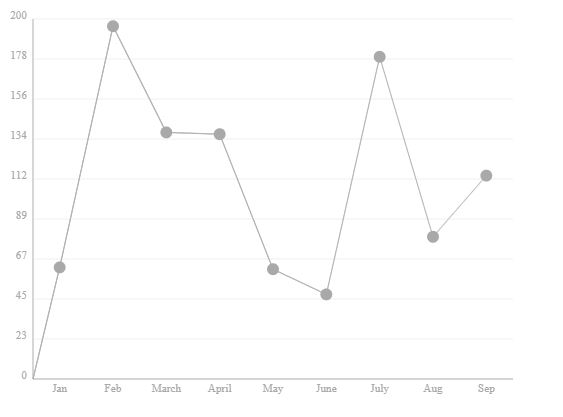

# TChart.js
simple and configurable Bar and Line Chart library in Javascript

## Description
TChart.js is a canvas based simple Javascript Bar and Line Chart Library to provide simple, configurable and dependency-free experience.

